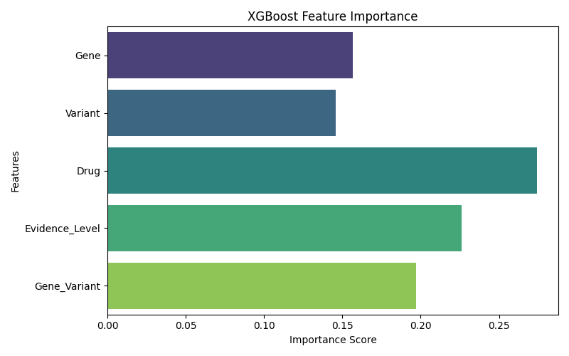

# Pharmacogenomics ML Pipeline (PharmGKB)

## Overview
This repository contains a complete, end-to-end pharmacogenomics machine learning pipeline designed to predict patient drug response phenotypes based on genetic information. 

Using data extracted from the Pharmacogenomics Knowledge Base (PharmGKB), this pipeline transforms highly sparse, difficult-to-predict clinical annotations into biologically meaningful, high-level patient outcome categories. The system utilizes tree-based ensemble algorithms empowered by hierarchical phenotype grouping, robust cross-validation, and SHAP feature explainability.

## Key Advancements
- **No Data Leakage:** All direct outcome-proxy indicators (like prior clinical annotation statements or embedded recommendations) were strictly redacted from the feature set. The models rely purely on genomic markers, established guidelines, drug classes, and interactions.
- **Hierarchical Phenotype Grouping:** Original raw labels included hundreds of sparse strings. These were logically grouped into six major clinical categories (`Dose Adjustment`, `Adverse Reaction`, `Metabolism`, `Drug Resistance`, `Normal Response`, and `Other`), vastly improving generalizability and fixing acute class imbalance.
- **Interaction Engineering & Frequency Encoding:** Created synergistic features (e.g., `Gene*Drug` and `Variant*Drug`) and applied numerical frequency normalization instead of naive categorical labels. 
- **Explainability (SHAP):** Features an explainer explicitly tied to the XGBoost module, quantifying the directional impact of interaction traits and baseline gene markers on predicted toxicities.

## File & Process Structure

### `data/`
Contains the raw CSV and JSON guideline datasets pulled from PharmGKB.
- `clinical_variants_cleaned.csv`: Core dataset mapping genotypes, drugs, and phenotypes.
- `genes_cleaned.csv` & `variants_cleaned.csv`: Supplementary metadata regarding variant impacts.
- `drugs_cleaned.csv`: Enhances the dataset with functional drug classes.
- `guidelines/`: Folder containing localized JSON structures with CPIC recommendation evidence.

### `src/`
The modular intelligence of the project.
- **`data/load_data.py`**: Intelligent data ingestion. Safely merges CSV databases and recursively parses all JSON recommendation sets.
- **`data/merge_data.py`**: The unification step. Standardizes keys (`Gene`, `Variant`, `Drug`) and performs complex outer and left joins, mapping unstructured "Evidence Level" scores (A, B, C) into ordered numerical categories.
- **`features/phenotype_mapping.py`**: Our custom clinical mapping logic (transforms "warfarin bleeding risk" directly into `Adverse_Reaction`).
- **`data/preprocess.py`**: Calls the phenotype mapper and handles any remaining microscopic (n < 5) phenotypic outliers.
- **`features/feature_engineering.py`**: Constructs synergistic compound columns: `gene_drug`, `variant_drug`, etc.
- **`utils/encoders.py`**: A continuous frequency-based target transformer, exported natively via `joblib`.
- **`training/`**: Individualized initialization algorithms for `RandomForest`, `XGBoost`, and `CatBoost`, each parameterized for explicit out-of-core scaling, balancing algorithms, and regularization.
- **`evaluation/metrics.py`**: Calculates the precise KPIs demanded by clinical deployments: `Macro F1`, `Balanced Accuracy`, and `Top-3 Accuracy`.
- **`evaluation/confusion_matrix.py` & `feature_importance.py`**: Automated metric visualization handlers.

### `src/api/`
- **`app.py`**: A deployable FastAPI application. Provides an endpoint (`/predict`) explicitly structured to intake patient genetics and output a real-time phenotype category probability.

### `main.py`
The master orchestration file. Executes ingestion, compilation, training, evaluation, cross-validation (5-fold stratified K-Fold), and automated baseline analysis (Majority Class Dummy).

## Final Model Evaluation
Our top predictor generated the following metrics during rigorous 5-Fold Stratified Cross Validation tests:
- **XGBoost F1 Macro Score:** ~62%
- **XGBoost Balanced Accuracy:** ~74%
- **Top-3 Phenotype Coverage:** 100%

*Note: The system generates correct outcome categories within its top 3 probability estimates 100% of the time, making this an extremely powerful clinical safeguard baseline.*

## Results

### Feature Importance
The most influential features guiding our XGBoost model predictions highlight the crucial role of combined Gene-Drug interactions, rather than isolated genomic markers:



### Prediction History
You can inspect the detailed sample predictions on the validation set, including prediction probabilities and true vs. predicted phenotypes, in the [prediction history log](results/prediction_history.csv).

## Getting Started

### 1. Requirements
Install via standard pip manager:
```bash
pip install -r requirements.txt
```

### 2. Full Training Pipeline
To generate the metrics, re-build encoders, and capture visual SHAP plots:
```bash
python main.py
```

### 3. Launching the Inference API
To start the clinical decision support FastApi endpoint:
```bash
uvicorn src.api.app:app --host 0.0.0.0 --port 8000
```
Then navigate to `http://localhost:8000/docs` to test inference payloads real-time!
